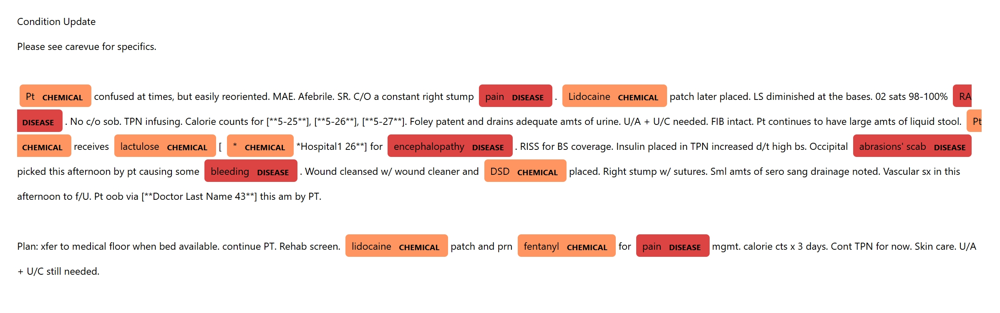
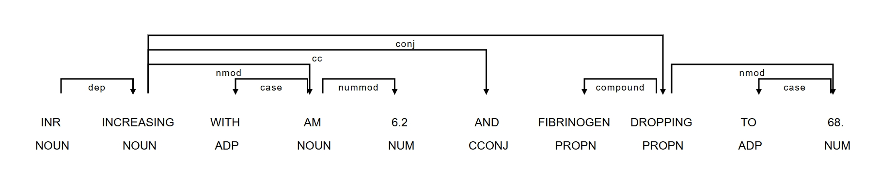
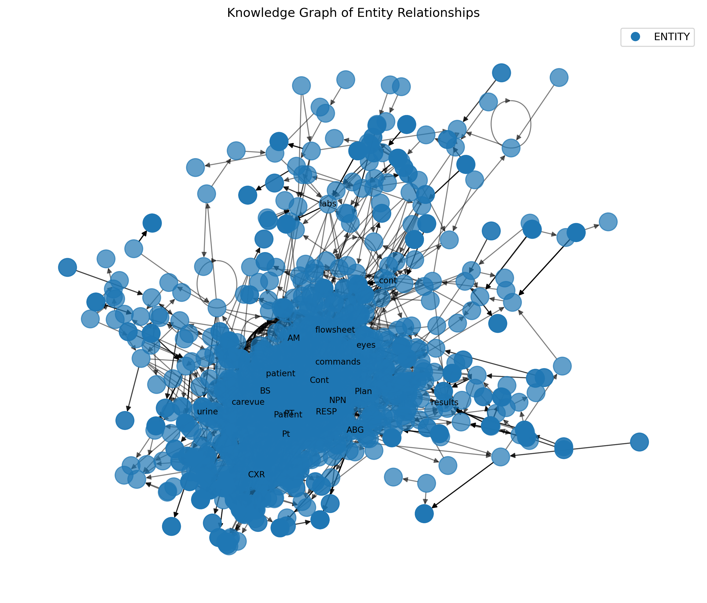
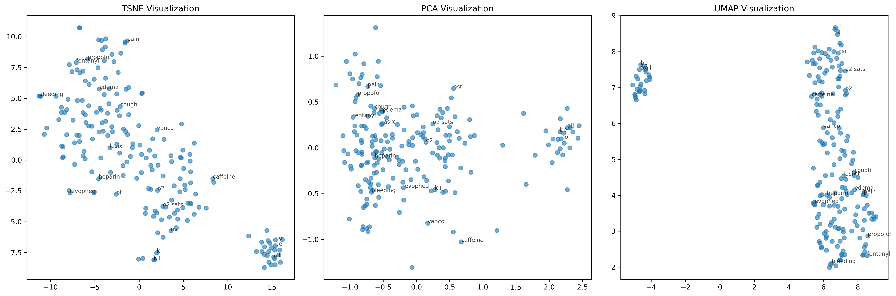
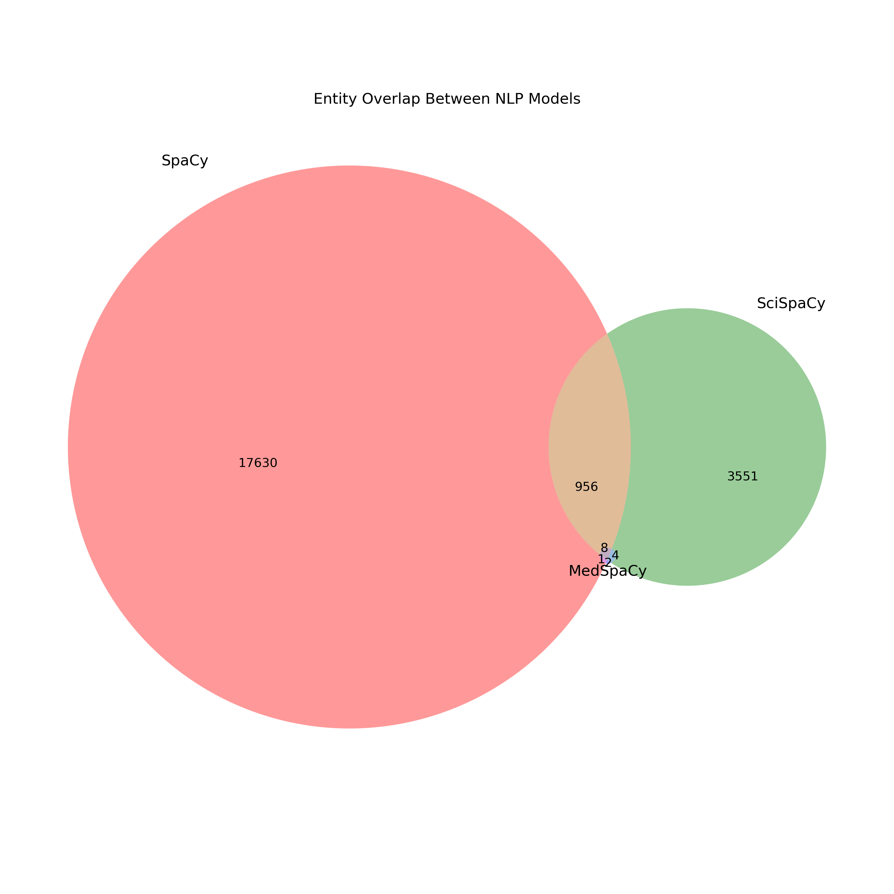

# MIMIC-III Clinical NLP: ICU Entity Extraction & Medical Embeddings

## Overview
An advanced NLP pipeline leveraging spaCy, SciSpacy, MedSpacy, and ClinicalBERT to extract clinically relevant entities from MIMIC-III ICU notes, with a focus on stroke (ICD-9: 430, 431, 434.x) and other high-impact conditions. It applies medical-specific text normalization, syntactic dependency parsing, and custom word embeddings (Word2Vec, BioWordVec, ClinicalBERT) to enhance entity recognition and semantic analysis. The project integrates t-SNE clustering, frequency distributions, and dependency visualization to uncover patterns in disease progression, treatment pathways, and patient stratification within critical care settings.

## Features
- **Efficient Data Loading**: Uses DuckDB queries for optimized retrieval of clinical notes based on ICD-9 codes and note categories.
- **Multi-Model Entity Extraction**: Compares SpaCy’s general-purpose model with SciSpacy’s biomedical model and MedSpacy for clinical context handling.
- **Word Embeddings & Semantic Analysis**: Trains custom Word2Vec embeddings on extracted entities or loads pre-trained embeddings from Gensim.
- **Relationship Extraction & Knowledge Graphs**: Identifies subject-verb-object relationships and constructs knowledge graphs using NetworkX.
- **Advanced Visualization**: Provides t-SNE embeddings, entity overlap plots, contextual attribute displays, and dependency parsing visualizations.

## Installation
### Prerequisites
Ensure Python 3.8+ is installed, along with the necessary dependencies:

```bash
conda install python=3.8 duckdb pandas numpy spacy scispacy gensim matplotlib scikit-learn tqdm networkx seaborn 
pip install medspacy  # Optional for clinical-specific NLP processing
```

Download relevant SpaCy/SciSpacy models:
```bash
python -m spacy download en_core_web_sm
python -m spacy download en_ner_bc5cdr_md
```

(Optional) Install UMAP for advanced dimensionality reduction:
```bash
pip install umap-learn
```

## Usage
Run the script from a terminal:

```bash
python mimic_nlp.py \
  --db_path "path/to/mimic.duckdb" \
  --icd9_codes "430,431,434.x" \
  --note_category "Nursing/other" \
  --embedding_choice both \
  --visualize_entities \
  --extract_relationships \
  --output_path results \
  --use_medspacy
```

Adjust flags as needed. Logs, outputs, and generated plots will be stored in the `results` directory.

## Project Structure
```
.
├── mimic_nlp.py        # Main NLP pipeline script
├── README.md           # Documentation
├── requirements.txt    # Dependencies
├── results/            # Default output folder
└── ...
```

## GPU Utilization
This project leverages GPU acceleration where available to optimize NLP model inference times. The use of ClinicalBERT and other transformer-based models benefits from CUDA-enabled hardware, significantly reducing computation time for entity extraction and embedding generation.

## **Initial Key Findings**

### **Entity Visualization Plot**
This NER visualization highlights key medical terms in an ICU clinical note, categorizing diseases (red) and medications (orange) relevant to sepsis management. Conditions like encephalopathy, pain, and bleeding suggest potential complications, while medications such as lidocaine, fentanyl, and lactulose indicate pain management and gastrointestinal support. Extracting these entities from unstructured text aids NLP-based sepsis detection models in automated diagnosis and treatment tracking.



### **Dependency Parse**
This dependency parse visualizes the syntactic structure of a clinical statement, highlighting key relationships between INR and fibrinogen levels. The phrase indicates that INR is increasing (to 6.2), while fibrinogen is dropping (to 68), which may signal coagulopathy, a critical concern in sepsis. Such parsing aids NLP models in extracting lab trends for automated sepsis progression monitoring.



### **Knowledge Graph of Entity Relationships**
This knowledge graph visualizes entity relationships in ICU clinical notes, revealing a dense network where key terms such as flowsheet, patient, urine, and ABG act as central hubs. The high connectivity suggests complex interactions between lab results, physiological measurements, and treatment plans, which is valuable for sepsis progression tracking. Such a structure helps NLP models improve entity extraction and contextual understanding in clinical decision support.



### **Dimensionality Reduction Comparison**
The t-SNE, PCA, and UMAP visualizations compare different dimensionality reduction techniques for clinical text embeddings, revealing how terms related to sepsis and ICU treatment cluster in different spaces. t-SNE shows more localized groupings of related terms (e.g., pain, propofol, fentanyl), while PCA maintains a broader distribution with some separation between concepts. UMAP appears to create a linear structure, which may indicate a progression in disease severity or treatment stages, potentially aiding in sepsis classification.



### **Entity Overlap Venn Diagram**
The Venn diagram compares entity recognition overlap among SpaCy, SciSpaCy, and MedSpaCy, highlighting significant differences in their extracted medical terms. SpaCy identifies the largest number of entities, but its overlap with SciSpaCy is limited (956 shared entities), suggesting that general NLP models may not be optimized for clinical text. MedSpaCy, specifically designed for medical contexts, captures very few entities (14 total), indicating that it may be overly restrictive or tuned for high specificity in clinical NLP applications.



## License
This project is distributed under the MIT License.